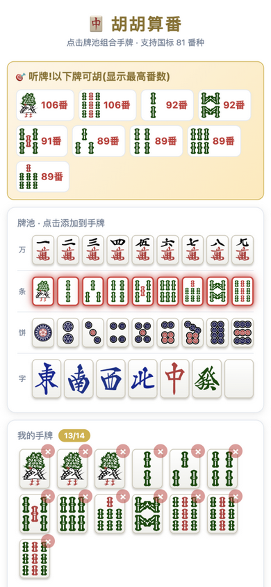
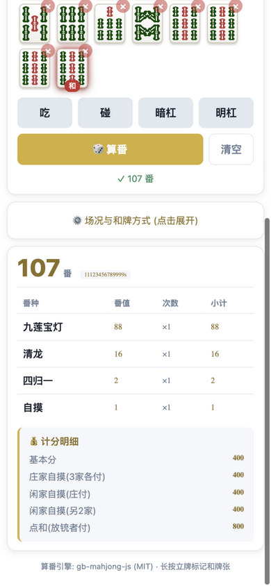

<div align="center">

# 🀄 胡胡算番

**国标麻将算番器 · Chinese Standard Mahjong (MCR) Fan Calculator**

一个完全离线的 Android 算番 App —— 点牌即算，支持全部 **81 种番型**，无需联网、无广告、无任何博彩功能。

[](LICENSE)
[](../../releases)
[](../../releases)
[](#-功能特性)
[](../../stargazers)

</div>

---

## 📸 界面预览

| | |
|:---:|:---:|
| **主界面** · 四行牌池，点击选牌 | **听牌提示** · 13 张自动列出全部听牌与番数 |
|  |  |
| **算番结果** · 番种明细 + 计分 | **副露分组** · 碰 / 暗杠自动成组 |
|  |  |

---

## ✨ 功能特性

### 点牌输入
- 🎯 **四行牌池**：万 / 条 / 饼 / 字各占一行，同种牌用满 4 张自动置灰
- 🀄 **一键副露**：点「吃 / 碰 / 暗杠 / 明杠」后再点牌池一张牌，自动组成副露组
  - 吃：以点击的牌为顺子**最小张**（点 3 万 = 吃 2-3-4 万）
  - **暗杠与明杠分开处理**——暗杠计入暗刻且不破门前清，两者番差可达 17 番
- 🖐️ **和牌张标记**：长按（手机）/ 右键（桌面预览）手牌即可标记，红框 + 「和」字标识

### 智能提示
- 🔔 **听牌提醒**：手牌到 13 张时自动计算所有听牌，顶部横条显示**每张听牌的番数**，牌池中对应牌红色脉冲高亮
- 🧮 **完整算番**：国标（中国麻将竞赛规则）全部 81 番种，自动求最优牌型拆解，不漏番、不重番
  - 例：`1112345678999s` 自摸 → 正确识别九莲宝灯 88 + 清龙 16 + 四归一 2 + 自摸 1 = **107 番**

### 场况与计分
- ⚙️ **场况设置**：和牌方式（自摸 / 点和 / 杠上开花 / 海底捞月 / 妙手回春 / 和绝张）、圈风、门风、花牌数
- 💰 **计分明细**：番数转基本分，列出庄家自摸 / 闲家自摸 / 点和三种分摊方式

### 体验
- 📴 **完全离线**：算番引擎直接打包进 APK，不申请网络权限，飞行模式可用
- 📱 **手机适配**：触屏热区、按压反馈、振动提示、防误触缩放

---

## 📱 下载安装

1. 前往 [**Releases**](../../releases) 页面，下载最新 `huuh-suanfan-vX.X.apk`
2. 传到 Android 手机（微信 / 网盘 / 数据线均可），点击安装
3. 系统提示「未知来源应用」时选择允许（debug 签名的正常现象）

> 支持 Android 7.0（API 24）及以上。

---

## 🛠️ 从源码构建

### 环境要求

| 依赖 | 版本 |
|---|---|
| Node.js | ≥ 18 |
| JDK | 21 |
| Android SDK | platform-tools、platforms;android-36、build-tools |

### 构建步骤

```bash
git clone https://github.com/mfchen123/huuh-suanfan.git
cd huuh-suanfan/app

# 1. 安装依赖
npm install

# 2.（可选）重新打包算番引擎
#    仓库已内置构建好的 www/gb-bundle.js，仅改动 entry.js 或升级依赖时需要
npx esbuild entry.js --bundle --platform=browser --format=iife \
    --global-name=GBM --minify --outfile=www/gb-bundle.js

# 3. 同步 Web 资源到 Android 工程
npx cap sync android

# 4. 构建 APK
cd android && ./gradlew assembleDebug
# 产物: android/app/build/outputs/apk/debug/app-debug.apk
```

> 日常改前端只需重复步骤 3、4；首屏 UI 与全部交互逻辑都在 [`app/www/index.html`](app/www/index.html) 一个文件里。

<details>
<summary><strong>🌏 网络受限环境（中国大陆）</strong></summary>

本项目已配置腾讯云 / 阿里云镜像源（Gradle wrapper、build.gradle）。若依赖下载仍失败，可将 [`docs/gradle-mirror-init.gradle`](docs/gradle-mirror-init.gradle) 复制到 `~/.gradle/init.d/init.gradle` 启用全局镜像。

</details>

---

## 🧱 技术架构

```
┌──────────────────────────────────────────────┐
│  Android APK（Capacitor 8 打包，4.4 MB）        │
│  └── WebView（系统 Chromium 内核）               │
│      ├── index.html      单文件前端，零框架       │
│      ├── gb-bundle.js    算番引擎（esbuild 打包） │
│      └── assets/tiles/   34 张麻将牌 SVG（CC0）  │
└──────────────────────────────────────────────┘
```

- **算番引擎**：[gb-mahjong-js](https://github.com/tziakcha-stats/gb-mahjong-js)（MIT）纯 JavaScript 实现，在 WebView 内直接运算，**完全离线**，实测九莲宝灯等复杂牌型毫秒级出结果
- **牌面素材**：[riichi-mahjong-tiles](https://github.com/FluffyStuff/riichi-mahjong-tiles)（CC0 公共领域），矢量 SVG 任意缩放不失真
- **打包**：[Capacitor](https://capacitorjs.com/)（MIT）将 Web 前端封装为原生 Android 工程

为什么不用 C++/NDK？算番引擎有纯 JS 等价实现，免去交叉编译与 JNI 桥接，APK 更小、维护更简单，结果与参考 C++ 实现（PyMahjongGB 同源算法）完全一致。

---

## 📁 目录结构

```
├── app/                       # Android App 主项目
│   ├── www/
│   │   ├── index.html         # 全部 UI 与交互逻辑（单文件）
│   │   ├── gb-bundle.js       # 算番引擎（由 entry.js 打包生成）
│   │   └── assets/tiles/      # 34 张麻将牌 SVG
│   ├── android/               # Capacitor 生成的 Android 工程
│   ├── entry.js               # 算番引擎打包入口
│   └── capacitor.config.json
├── demo/                      # 早期 Web 版（C++ 算番 + Python 本地服务，留档参考）
├── docs/
│   ├── screenshots/           # README 截图
│   └── gradle-mirror-init.gradle
├── LICENSE                    # MIT
└── THIRD_PARTY_LICENSES.md    # 第三方组件许可证声明
```

---

## 🗺️ Roadmap

- [ ] 加杠（碰后补杠）与明杠细分
- [ ] 花牌可视化选择（八种花牌图案）
- [ ] 多局累计计分器（四人记分本）
- [ ] 听牌效率分析（进张 / 改良，引擎已支持 `calcTing`）
- [ ] iOS 版（Capacitor 直接支持，欢迎 PR）
- [ ] 拍照识别手牌（调研中）

---

## 🤝 致谢

本项目站在以下开源项目的肩膀上，感谢各位作者：

| 项目 | 用途 | 许可证 |
|---|---|---|
| [gb-mahjong-js](https://github.com/tziakcha-stats/gb-mahjong-js) | 核心算番引擎 | MIT |
| [GB-Mahjong](https://github.com/zheng-fan/GB-Mahjong) | 算法底层来源 | MIT |
| [riichi-mahjong-tiles](https://github.com/FluffyStuff/riichi-mahjong-tiles) | 麻将牌 SVG 素材 | CC0 1.0 |
| [Capacitor](https://github.com/ionic-team/capacitor) | 混合应用框架 | MIT |
| [mahjong-algorithm](https://github.com/summerinsects/mahjong-algorithm) | 早期算法验证参考 | MIT |

完整许可证文本见 [THIRD_PARTY_LICENSES.md](THIRD_PARTY_LICENSES.md)。

## 🤝 参与贡献

欢迎 Issue 与 PR！开发调试最快捷的方式：

```bash
cd app/www && python3 -m http.server 8765
# 浏览器打开 http://localhost:8765 即可调试全部前端逻辑（无需 Android 环境）
```

---

## 📄 许可证

[MIT License](LICENSE) © 2026 mfchen123

## ⚠️ 免责声明

本项目仅作为**国标麻将规则学习与线下娱乐的算番辅助工具**，不包含任何联网对战、虚拟货币或博彩功能，亦不支持任何形式的赌博活动。请遵守当地法律法规合理使用。
